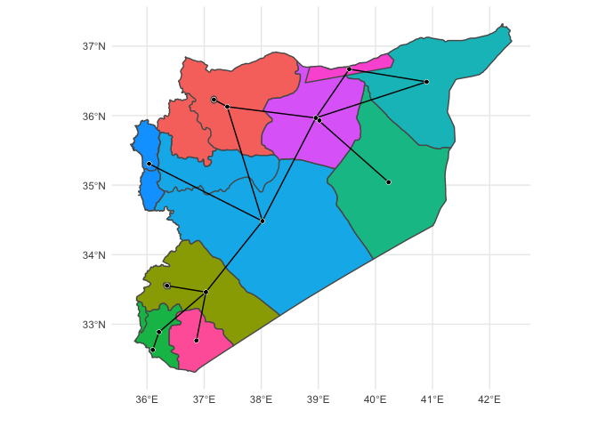
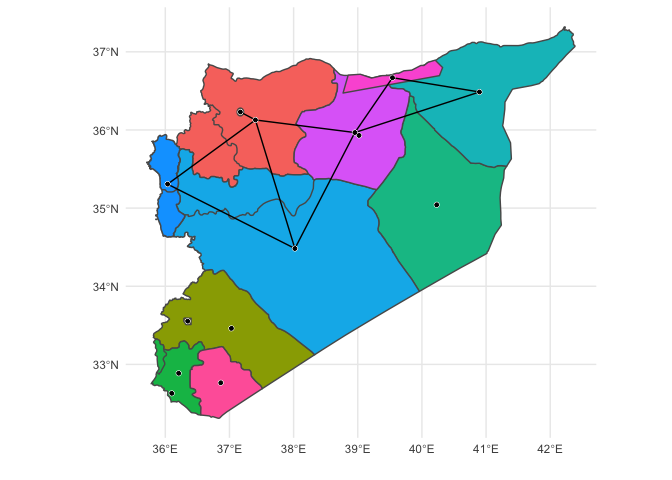

## **{migratr}**

A set of tools for unifying **{sf}** and **{igraph}** object for
geospatial network analysis.

## Install

First, if you haven’t done so, install `remotes`:

``` r
install.packages("remotes")
```

Proceed to install **{migratr}** from Github:

``` r
remotes::install_github("cjcallag/migratr")
```

<<<<<<< HEAD
## Example: All Populations
=======
## Example
>>>>>>> 4e7071ce16ebdd4f243a03cec1e7652cbd1ba98f

The goal is to create representations of network both projected over a
map or as a sociogram. Because the network is the unit of analysis, the
functions are designed to work with both a edge and node list.

First, load the package and any other tools you may require (I suggest
using **{tidyverse}** tools for data manipulation):

``` r
library(migratr)
library(tidyverse)
```

Now load the sample node and edge lists:

``` r
edges <- migratr::edgelist
nodes <- migratr::nodelist
```

  - Edges list: A `data.frame` containing a symbolic edge list in the
    first two columns. Additional columns are considered as edge
    attributes.

<!-- end list -->

``` r
glimpse(edges)
#> Observations: 115
#> Variables: 3
#> $ from      <chr> "Aleppo and Idlib Province [NSYAI] (Halab and Idlib governo…
#> $ to        <chr> "Aleppo City [NSYAICIT] (Mount Simeon / Jabal Sem’an Distri…
#> $ edge_type <chr> "Population", "Population", "Population", "Population", "Po…
```

  - Nodes list: A `data.frame` and `sf` class object with node metadata.
    The first column will be assumed to contain the symbolic vertex
    names.

<!-- end list -->

``` r
glimpse(nodes)
#> Observations: 14
#> Variables: 5
#> $ neighborhood_id  <chr> "Aleppo and Idlib Province [NSYAI] (Halab and Idlib …
#> $ geometry         <MULTIPOLYGON [°]> MULTIPOLYGON (((37.77172 35..., MULTIPO…
#> $ lon              <dbl> 37.40469, 37.17000, 36.34893, 37.03019, 36.10000, 36…
#> $ lat              <dbl> 36.12795, 36.23000, 33.55288, 33.46118, 32.63000, 32…
#> $ total_population <dbl> 2681318, 2567509, 2350000, 308669, 68532, 1528403, 8…
```

Using the edge and node list produce a new object with relationships and
geographic data:

``` r
migratr_object <- migratr::get_proto_graph(edges = edges[edges["edge_type"] == "Adjacency/Population",],
                                           nodes = nodes)
migratr_object
#> PROTO_GRAPH 
#>  Nodes: 14
#>  Edges: 15
```

Plot `migratr_object`:

``` r
plot(migratr_object)
```


<<<<<<< HEAD

## Example: The Kurds

Load required data:

``` r
edges <- migratr::kurds_edgelist
glimpse(edges)
#> Observations: 9
#> Variables: 3
#> $ from      <chr> "Homs and Hama [NSYHH] (Homs and Hama Governorates)", "Raqq…
#> $ to        <chr> "Latakia [NSYLT] (Latakia Governorate)", "Homs and Hama [NS…
#> $ edge_type <chr> "Shared_Kurds", "Shared_Kurds", "Shared_Kurds", "Shared_Kur…
nodes <- migratr::kurds_nodelist
glimpse(nodes)
#> Observations: 14
#> Variables: 13
#> $ neighborhood_id                                              <chr> "Aleppo …
#> $ geometry                                                     <MULTIPOLYGON [°]> …
#> $ lon                                                          <dbl> 37.40469…
#> $ lat                                                          <dbl> 36.12795…
#> $ Population                                                   <dbl> 920040, …
#> $ `Vertical Relationship to Syrian Government Actor (Week 1)`  <dbl> 0.040893…
#> $ `Vertical Relationship to Turkish Government Actor (Week 1)` <dbl> -0.05270…
#> $ `Vertical Relationship to US Government Actor (Week 1)`      <dbl> 0.288003…
#> $ `Vertical Relationship to Kurdish Actor (Week 1)`            <dbl> 0.657115…
#> $ `Vertical Relationship to ISIL Actor (Week 1)`               <dbl> -0.47825…
#> $ group                                                        <chr> "Syrian …
#> $ mood                                                         <dbl> -42.85, …
#> $ security                                                     <dbl> -64, -27…
```

Using the edge and node list produce a new object with relationships and
geographic data:

``` r
migratr_object <- migratr::get_proto_graph(edges = edges,
                                           nodes = nodes)
migratr_object
#> PROTO_GRAPH 
#>  Nodes: 14
#>  Edges: 9
```

Plot `migratr_object`:

``` r
plot(migratr_object)
```


=======
>>>>>>> 4e7071ce16ebdd4f243a03cec1e7652cbd1ba98f
